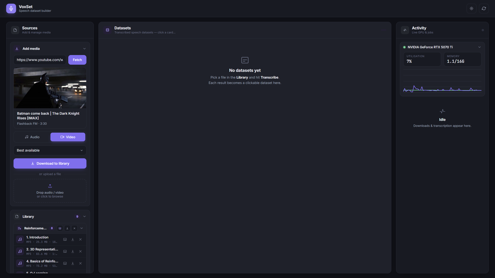
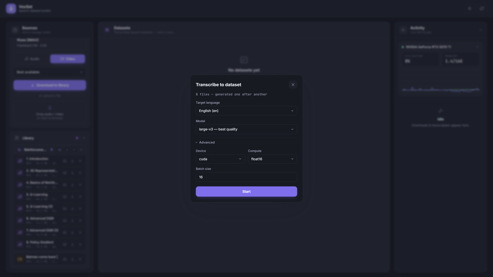
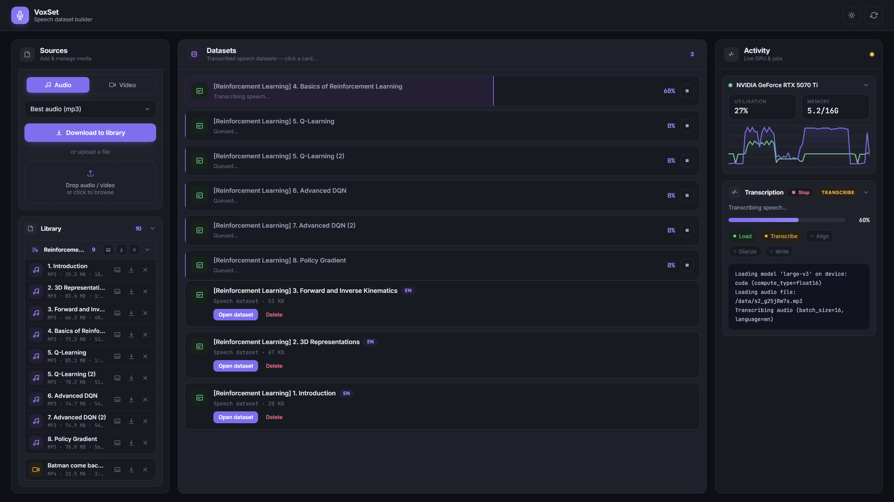
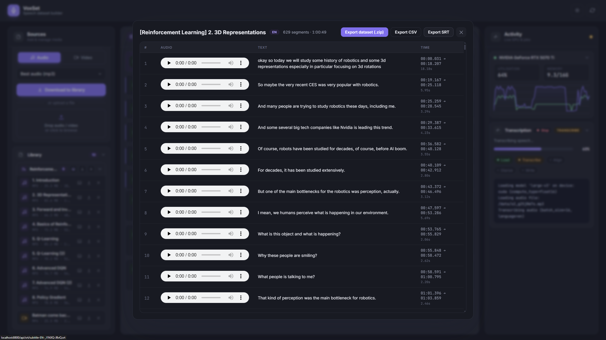

# VoxSet — Speech Dataset Builder

A **fully Dockerized** web app that turns any video or audio into a
**speaker-labeled speech dataset**, built on
[WhisperX](https://github.com/m-bain/whisperX). Download a single video or a
whole **playlist** — as **audio** or **video** at a chosen quality — into a local
library, then **transcribe** any file into a dataset of segments, each with its
own audio clip, text, time range, and speaker.

The workflow is three decoupled stages:

1. **Get media** — paste a video/playlist link (or upload a file). Pick audio or
   video + quality, then download. Everything lands in a **Library**.
2. **Transcribe** — pick any library file and run transcription → alignment →
   speaker diarization. One GPU job at a time; whole playlists can be queued.
3. **Dataset** — every result is a clickable **speech dataset**: each segment is a
   row with its **cropped audio**, **text**, and **time range**. Export the whole
   thing as a **`.zip`** (one wav clip per segment + `metadata.csv`), a
   **`.csv`**, or an **`.srt`**.

The interface is a clean light/dark dashboard with three columns — **Library**
(sources), **Datasets** (outputs), and **Activity** — with per-item download
progress (great for playlists), a live GPU monitor, and stage-by-stage
transcription progress. Everything runs inside Docker — no Python, ffmpeg, or
CUDA setup on the host.

## Screenshots

<table>
  <tr>
    <td width="50%"><br><sub><b>Home</b> — Sources, Datasets, and Activity at a glance</sub></td>
    <td width="50%"><br><sub><b>Transcribe</b> — language, model, and advanced options</sub></td>
  </tr>
  <tr>
    <td width="50%"><br><sub><b>Process</b> — live GPU monitor and stage-by-stage progress</sub></td>
    <td width="50%"><br><sub><b>Dataset</b> — per-segment audio, text, and time range</sub></td>
  </tr>
</table>

## Project layout

```
src/          core pipeline (config, yt-dlp download, whisperx transcribe/align/diarize)
web/          FastAPI app (web/app.py) + static UI (web/static)
data/         inputs + generated datasets (.srt) (bind-mounted into the container)
```

## Requirements

- [Docker](https://docs.docker.com/get-docker/) + Docker Compose
- An NVIDIA GPU with GPU support enabled in Docker:
  - **Windows**: Docker Desktop with the WSL2 backend (GPU support is built in) + up-to-date NVIDIA driver.
  - **Linux**: the [NVIDIA Container Toolkit](https://docs.nvidia.com/datacenter/cloud-native/container-toolkit/latest/install-guide.html).
- A Hugging Face token (`HF_TOKEN`) for speaker diarization (see below).
- _CPU-only is possible but slow — see the note at the end._

> **GPU compatibility:** the image is built on **CUDA 12.8 + PyTorch cu128** and
> force-installs **ctranslate2 4.8.0**, so it supports current NVIDIA GPUs
> including **Blackwell / RTX 50-series (sm_120)** — verified end-to-end on an
> RTX 5070 Ti. Other CUDA dependency notes are documented in `CLAUDE.md`.

## Quick start

1. Clone the repository:

   ```bash
   git clone https://github.com/omerfarukaydin61/whisperX-subtitle-generator.git
   cd whisperX-subtitle-generator
   ```

2. Create your `.env` from the template and fill it in:

   ```bash
   cp .env.example .env
   ```

   The only setting in `.env` is `HF_TOKEN` (needed for diarization). All
   per-job choices — source, audio/video, quality, language, model — are made in
   the web UI.

3. Build and start the web app:

   ```bash
   docker compose up -d --build
   ```

4. Open **http://localhost:8800** and use the two-stage flow below.

### Using it

**Add media** (top-right button): paste a video **or playlist** link and click
**Fetch**.

- For a single video you get a preview; for a playlist you get a checklist of
  all videos (toggle which to grab).
- Choose **Audio** (extracted to mp3 — best for transcription) or **Video** (merged
  mp4) and a **quality**, then click **Download to library**. Per-item progress
  shows in the **Activity** view.
- No link? Drag-and-drop or browse to **upload** a local file in the same dialog.

**Library** column: every downloaded/uploaded file is a compact row (title, type,
size, duration, dataset count); same-playlist items are grouped. Per row you can:

| Action            | What it does |
|-------------------|--------------|
| **Transcribe**    | opens language/model options, then transcribes → aligns → diarizes into a dataset |
| **Save**          | downloads the media file to your computer (the "downloader" part) |
| **Delete**        | removes the file (and its datasets) |

A playlist group header also has bulk **Transcribe-all / Download-all /
Delete-all** buttons. The transcription options (in the **Transcribe** dialog)
are: target language (a dropdown of all Whisper languages + Auto-detect), model
(`large-v3` … `base`), and Advanced device/compute/batch settings. Live progress
shows in **Activity**, and an in-progress item fills as a placeholder card in the
**Datasets** column (with a Stop button).

**Datasets** column: every transcription is a card — click it (or **Open
dataset**) to open the dataset popup. Each segment is a row with a **playable
cropped audio clip**, its **text**, and its **time range**. From the popup you
can **Export dataset (.zip)** (a `clips/seg-NNNN.wav` per segment + a
`metadata.csv` of `file,start,end,text`), **Export CSV**, or **Export SRT**.

Generated datasets land in `./data/` as `subtitle-<LANG>-<name>.srt`. Audio
clips are cut on the fly from the original media with ffmpeg, so the source file
must still be in the library for clips and the `.zip` export. Models (~3 GB for
`large-v3`, plus alignment & diarization models) are cached in a Docker named
volume (`model-cache`), so they download only once.

## Setting up `HF_TOKEN` (Hugging Face Token)

Speaker diarization requires a free Hugging Face access token:

1. Create an account at [huggingface.co/join](https://huggingface.co/join).
2. Generate a token at [huggingface.co/settings/tokens](https://huggingface.co/settings/tokens) (read access is enough). It looks like `hf_ABc...`.
3. Put it in your `.env`:

   ```
   HF_TOKEN=hf_ABc...
   ```

## Example

To build a Turkish speech dataset from a YouTube short
(<https://www.youtube.com/shorts/tI354Xu6xRs>):

1. Open **http://localhost:8800**, expand **Add media**, paste the link, and
   click **Fetch**.
2. Keep **Audio** selected and click **Download to library** — it appears in the
   **Library** column.
3. On its row click **Transcribe**, set the language to `tr`, and **Start**.
4. Watch the live progress in **Activity** (and the filling card in **Datasets**);
   when done, click the new dataset to inspect each segment's audio + text, and
   **Export dataset (.zip)** / **CSV** / **SRT** as needed.

## CPU-only

No NVIDIA GPU? Use the CPU compose file — it skips the GPU reservation and
defaults the device to `cpu` / `int8`:

```bash
docker compose -f docker-compose.cpu.yml up -d --build
```

It reuses the same image (the bundled CUDA libraries simply go unused), so the
web UI is identical at **http://localhost:8800**. Transcription is considerably
slower than on a GPU, so prefer a smaller model (e.g. `medium` or `small`).

## Running locally without Docker (optional)

You can still run it directly if you have Python 3.10, `ffmpeg`, and a CUDA setup
(settings are read from `.env` / environment variables):

```bash
pip install -r requirements.txt
uvicorn web.app:app --host 0.0.0.0 --port 8000   # web UI on http://localhost:8000
```
